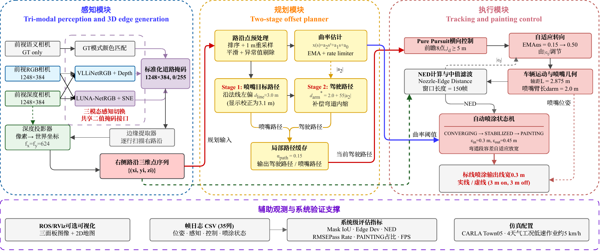
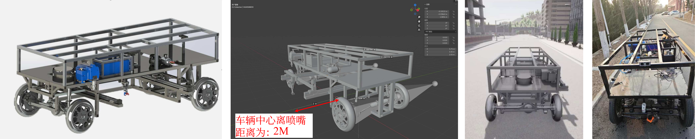
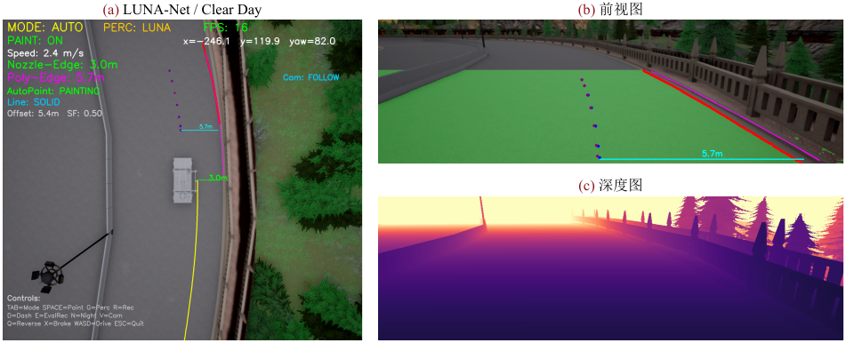

# AutoStripe: Automatic Line-Marking System

[](https://www.python.org/)
[](https://www.ros.org/)
[](https://carla.org/)
[](LICENSE)

**AutoStripe** is an integrated automatic line-marking system that bridges the gap between road segmentation algorithms and real-world marking operations. It combines perception (VLLiNet/LUNA-Net), path planning, and execution control into a closed-loop pipeline, validated on the CARLA simulation platform.

---

## 🎬 Demo Video

https://github.com/Bingtao-Wang/AutoStripe-Public/assets/划线机功能演示.mp4

*Automatic line-marking demonstration in CARLA simulator showing the complete perception-planning-control pipeline.*

---

## 🎯 System Overview

**Mission**: Validate perception algorithms (VLLiNet, LUNA-Net) in a complete marking workflow from road segmentation to precise paint spraying.

**Key Features**:
- Three-modal perception switching (Ground Truth, VLLiNet, LUNA-Net)
- Two-level offset path planning (road edge → nozzle path → driving path)
- Pure Pursuit lateral controller with adaptive look-ahead
- Auto-spray state machine for solid/dashed line marking
- Multi-weather CARLA simulation validation

---

## 🏗️ System Architecture



**Three-Stage Pipeline**:
1. **Perception**: RGB + Depth → Road segmentation → Edge extraction → 3D projection
2. **Planning**: Road edges → Two-level offset path planning → Driving path + Nozzle path
3. **Execution**: Pure Pursuit controller + Auto-spray state machine

---

## 🚗 Virtual Line-Marking Machine



**Modeling Pipeline**: SolidWorks CAD → Blender rigging → CARLA integration

**Key Parameters**:
- Nozzle offset: 2.0m from vehicle center
- Front camera: 1248×384, FOV 90°, pitch -15°
- Depth camera: Co-located with RGB camera

---

## 📦 Installation

### Requirements

- Python 3.8+
- ROS Noetic
- CARLA 0.9.13
- PyTorch 2.0+ (for perception modules)

### Setup

```bash
# Clone the repository
git clone https://github.com/yourusername/AutoStripe.git
cd AutoStripe

# Install Python dependencies
pip install -r requirements.txt

# Install ROS dependencies (if needed)
sudo apt-get install ros-noetic-rviz ros-noetic-tf
```

---

## 📂 Project Structure

```
AutoStripe/
├── src/
│   ├── experiment_runner_v5.py          # Automated experiment runner
│   ├── manual_painting_control_v5.py    # Manual control interface (v5)
│   └── manual_painting_control_v6.py    # Manual control interface (v6, latest)
├── scripts/
│   ├── frame_logger.py                  # Frame-by-frame data logger
│   ├── perception_metrics.py            # Perception accuracy metrics
│   ├── trajectory_evaluator.py          # Trajectory and control metrics
│   ├── visualize_eval.py                # Evaluation result visualization
│   └── visualize_map.py                 # Map and trajectory visualization
├── docs/
│   ├── Project_Design.md                # System design document
│   └── V6_Technical_Summary.md          # Technical implementation summary
├── figures/                             # Architecture diagrams and results
├── evaluation/                          # Evaluation results (to be added)
├── requirements.txt                     # Python dependencies
├── LICENSE                              # MIT License
└── README.md
```

---

## 🚀 Usage

### 1. Run Automated Experiments

```bash
# Run multi-weather experiments with specified perception mode
python src/experiment_runner_v5.py --mode vllinet --weather all
```

### 2. Manual Control Mode

```bash
# Launch manual control interface (latest version)
python src/manual_painting_control_v6.py
```

### 3. Evaluate Results

```bash
# Calculate perception and control metrics
python scripts/trajectory_evaluator.py --log_dir ./logs/experiment_name

# Visualize evaluation results
python scripts/visualize_eval.py --results ./evaluation/results.json
```

See [docs/V6_Technical_Summary.md](docs/V6_Technical_Summary.md) for detailed usage instructions.

---

## 📊 System Validation



**CARLA Multi-Weather Simulation**:
- Clear noon, sunset, night, foggy night, rainy night
- Quantitative metrics: Lateral error, nozzle distance accuracy, mask IoU
- Real-time ROS/RViz visualization for debugging

---

## 🔧 Core Modules

### 1. Three-Modal Perception Switching
- **GT Mode**: CARLA semantic segmentation (upper bound)
- **VLLiNet Mode**: Lightweight real-time perception (96.32% MaxF, 55 FPS)
- **LUNA-Net Mode**: Illumination-adaptive nighttime perception

### 2. Two-Level Offset Path Planning
- **Level 1**: Road edge → Nozzle target path (offset by line distance)
- **Level 2**: Nozzle path → Driving path (offset by nozzle arm + curvature compensation)

### 3. Pure Pursuit Lateral Control
- Look-ahead distance: Adaptive based on speed
- Steering filter: Hysteresis-based smoothing
- Lateral error: Used for adaptive filter tuning

### 4. Auto-Spray State Machine
- Distance monitoring with hysteresis
- Solid/dashed line mode support
- Automatic start/stop based on nozzle-edge distance

---

## 📝 Citation

This work is part of a Master's thesis at Shandong University (Chapter 4).

```bibtex
@mastersthesis{wang2026autostripe,
  title={Integration and Simulation Verification of Automatic Line-Marking System},
  author={Bingtao Wang},
  school={Shandong University},
  year={2026},
  chapter={4}
}
```

---

## 🙏 Acknowledgments

- **CARLA Simulator**: Thanks to the CARLA team for the open-source autonomous driving simulator
- **ROS Community**: Thanks for the robotics middleware and visualization tools

---

## 📧 Contact

**Bingtao Wang**
Shandong University
Email: wangbt@mail.sdu.edu.cn

---

**Last Updated**: 2026-03-13
